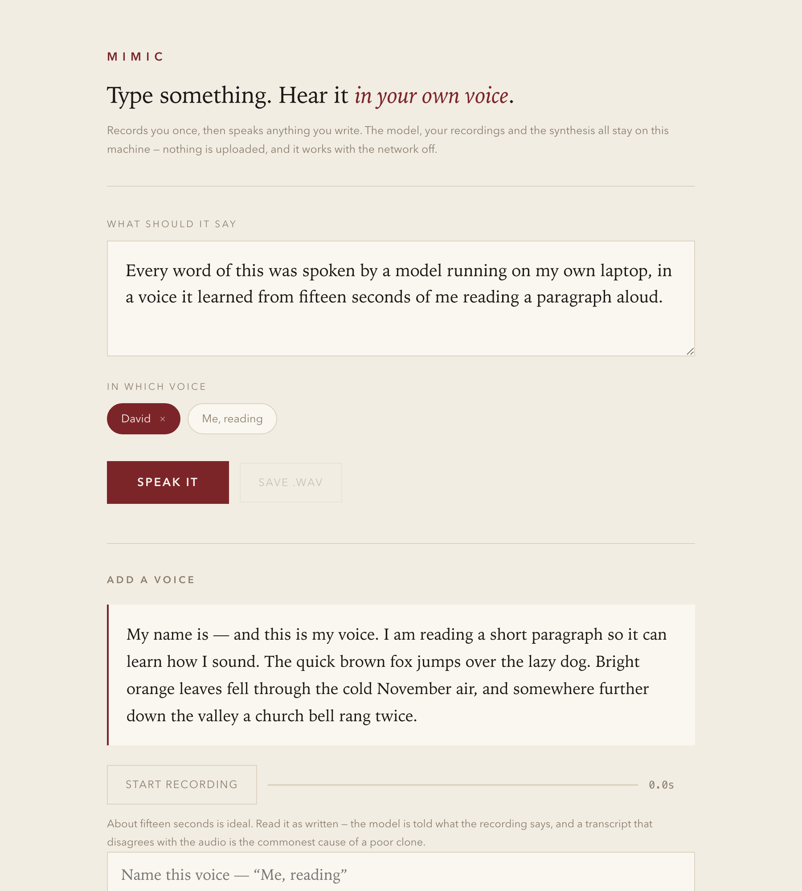
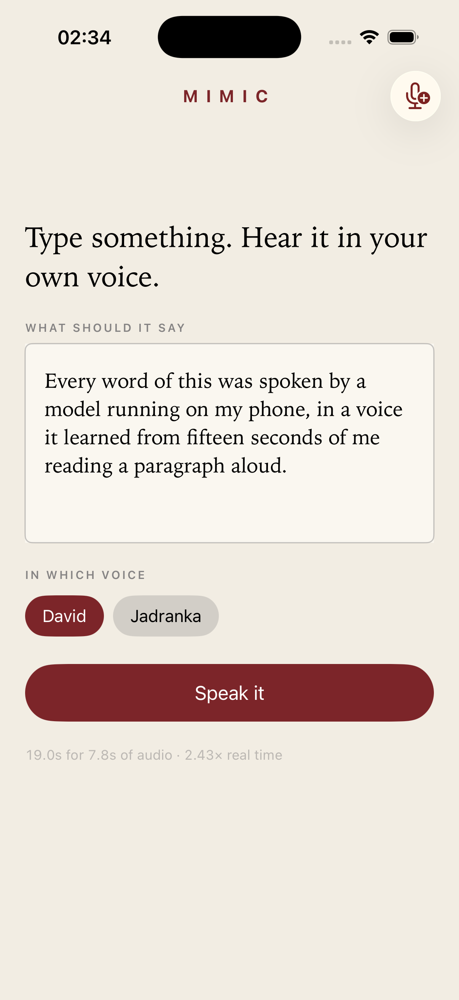

<div align="center">


# Mimic

**Type something. Hear it in your own voice.**

Records you reading a paragraph once, then speaks anything you write in that
voice — in a browser, in a Mac app, and on an iPhone with no network at all.

[](https://github.com/DavidCvetkovski/mimic/actions/workflows/tests.yml)
[](LICENSE)
[](requirements.txt)
[](MimicKit)

</div>

<table>
<tr>
<td width="58%"></td>
<td width="42%"></td>
</tr>
</table>

Nothing is uploaded. The model, the recordings and the synthesis all stay on the
machine — the phone included, where the whole engine is reimplemented in Swift
and runs with aeroplane mode on.

## What it is

| | |
|---|---|
| **Web** | Python engine, browser front end. The reference implementation. |
| **macOS** | SwiftUI app that starts the engine as a child process. |
| **iOS** | Everything reimplemented in Swift. No server, no Python, no network. |
| **MimicKit** | The Swift engine, as a package. Builds for iOS *and* macOS. |

The Swift side runs two models: the speech engine, and a small language model
that writes something to say. Neither is ever resident at the same time as the
other — half a gigabyte each is what a phone terminates an app for.

## Try it

```bash
uv venv --python 3.13 .venv
VIRTUAL_ENV=.venv uv pip install -r requirements.txt
.venv/bin/python -m core.server --setup     # downloads ~968 MiB, once
.venv/bin/python -m core.server
```

Open <http://127.0.0.1:8455>, read the paragraph aloud, and type something.

```bash
./macos/build.sh && open macos/build/Mimic.app     # the Mac app
open ios/Mimic.xcodeproj                           # the iPhone app
swift run -c release --package-path MimicKit mimic-speak "hello" --voice David
```
Running on a real phone needs a development team, and a team ID is personal, so
it is not in the repository. Put yours in `ios/Local.xcconfig`, which is not
tracked:

```
DEVELOPMENT_TEAM = ABCDE12345
```

Without it the project still opens and runs in the simulator. **Build Release**
for anything you intend to listen to — the engine is Swift doing a great deal of
arithmetic per frame, and a Debug build of it runs about twice as slow.

## What it costs

Measured on an M5, and on an iPhone 17 Pro simulator:

| | Python (web, macOS) | Swift (MimicKit) | iOS |
|---|---|---|---|
| Speed | 1.19× real time | **1.07×** | 2.43× (simulator) |
| Model load | 1.1s | 2.2s | ~3s |
| Memory | ~975 MB / 1.5 GB peak | same | same |
| Download | 968 MiB once | — | 600 MiB on first run |
| Cloning a voice | ~5s | ~5s | ~5s |

Saying the same thing twice is free, on all three: synthesis is deterministic
for a given seed, so a passage is kept on disk under its voice, seed and words
and read back instead of remade. It matters most on the phone, where re-rendering
something you just listened to would cost the whole wait again.

## The app, not the demo

The iPhone app is the one meant to be lived with rather than shown once, so it
has the parts a demo does not:

**A first run that explains itself.** Six hundred megabytes is a lot to ask of
somebody who has not heard it work, and the reason it is that large — the model
is on the phone — is the same reason the app is worth having. So it says so,
before it asks.

**A voice library.** People end up with several of themselves: bored, awake,
doing an accent. Each one can be played back, renamed and deleted, and the
recording it was made from is kept, because hearing it is the only way to tell
two of your own apart. Renaming moves the profile and the name inside it
together, and drops audio cached under the old name — which would otherwise be
filed under a name that no longer exists.

**Somewhere to see what it costs.** Which megabytes are the voice model, which
are the writer, which are cached audio, and a button for each that can be got
back. An app that downloads a gigabyte owes somebody that page.

**A way out.** Any passage saves as an M4A or as a video — black picture, your
voice — through the ordinary share sheet, so Files, WhatsApp, the camera roll
and AirDrop all work without the app knowing about any of them.

## Something to say

Most people open a text-to-speech app with nothing prepared, and a blank box is
a bad first impression. The iPhone app opens with six passages to tap — Hamlet,
Armstrong on the moon, Austen, Poe, Dickens — and a **Write me one** button that
asks a language model for whatever you describe: a birthday toast, a limerick
about a late cat.

There are two, and which one answers depends on the phone. Apple's ships with
the system, so it costs nothing and downloads nothing — but it only exists on
recent hardware with Apple Intelligence switched on, and it declines more than
you would expect; asked for a poem it will sometimes reply that it cannot help
with anything creative. So the app carries its own: **Qwen2.5-0.5B-Instruct**,
INT4, about 470 MB, fetched only when somebody taps the button and offered
again the first time Apple's model says no. It is smaller and less able, and it
does not refuse.

Either way the prompt never leaves the phone, which is the same promise the
rest of this makes — and with the local one, writing works in aeroplane mode
like everything else here.

Apache 2.0, which is why it can be here at all: of the small models usually
recommended for this, most are non-commercial.

The presets are all public domain. Song lyrics and film dialogue are the obvious
crowd pleasers and both are still in copyright — shipping them inside an app is
not the same as humming them in the shower.

## Waiting for it

Generating is slower than listening, so there is always a wait before the first
sound, and the app is mostly honest arithmetic about that wait. It knows roughly
how long a passage will take to say (about 65 milliseconds a character), it
renders a sentence at a time, and it starts playing at the earliest moment the
queue provably cannot run dry: bank *B* seconds of a *T*-second passage at rate
*r*, and playback is safe once *B ≥ T(r−1)/r*.

Run backwards, that same arithmetic is the countdown you see before anything
plays — using the rate this particular phone managed last time, remembered
between launches. It is deliberately vague, because it will be wrong: "playing
in about 20 seconds", never a ticking clock.

## It starts speaking before it has finished thinking

Generation runs slower than real time, so waiting for a whole paragraph means
waiting longer than it takes to say. All three apps therefore play the first
sentence while the rest is still being made — a twenty-second passage starts
after about five seconds instead of twenty.

Two things had to be got right.

**Which streaming.** The runtime ships a chunked decoder that re-decodes a
rolling window as frames arrive. Measured, it costs about twice the throughput,
and shrinking the context window to claw that back degrades the audio quickly —
the difference against a one-shot render goes from 0.018 to 0.36 at the extreme.
The extra work eats exactly the head start it buys, so the audio finishes no
sooner. Whole sentences avoid all of it: each is a clean one-shot render, bit
for bit what the non-streaming path produces, and the seams fall where a speaker
would pause anyway.

**When to start.** Too early and the sound stops mid-word; too late and there
was no point. Generation adds 1/r seconds of audio per second of wall clock and
playback consumes one, so starting with B banked out of a total T holds while
`B + t/r ≥ t`. The tightest moment is the last one before generation finishes:

```
B ≥ T · (r − 1) / r
```

A fraction of the **whole** passage, not of what is left — which is what this
first shipped with, and which ran dry every time. There is a property test that
simulates playback at 1.1x, 1.4x, 2x and 3x and asserts the queue never empties.
It failed on the first version, which is how the error was found.

The length of the passage is predicted from its text before any of it exists —
`seconds ≈ 0.0647 · characters`, fitted against measured output and within about
1.3s over a twenty-second line. That is what sizes the progress bar and feeds
the arithmetic above.

## Why there is no PyTorch

The obvious build is `transformers` plus the checkpoint. Going through ONNX
Runtime instead turned out better on every axis at once, which is unusual
enough to be worth stating:

| | PyTorch, 0.1b | ONNX Runtime, 0.6B INT4 |
|---|---|---|
| Parameters | 0.1b | **0.6B — six times more** |
| Speed | 1.70× real time | **1.19×** |
| Memory | ~3 GB plus the runtime | **~1 GB** |
| Install | 2.5 GB of PyTorch + 1.6 GB of weights | **968 MiB total** |
| Licence | Audio8 Community (revenue-capped) | **Apache 2.0** |
| Languages | 8 | 11 |

INT4 weight quantisation buys more on a CPU than the extra parameters cost. The
bigger model is the faster one, in less than half the memory, under a licence
that lets this repository exist.

## Getting it onto a phone

The iOS app runs the model itself. That took three things the documentation
does not mention:

**ONNX Runtime below 1.20 cannot load these models.** The INT4 graphs use the
`GatherBlockQuantized` contrib operator, added later. The Swift package's newest
*tag* is 1.19.2 — which makes this look impossible — but 1.24.2 is published as
a *release*, and works.

**Its Objective-C bindings cannot represent float16.** The whole element-type
enum is `Float`, the integer widths, and `String`. This model needs float16 for
all forty-eight KV cache tensors on the slow branch and for the hidden state
passed between branches, so the supported Swift path cannot run it at all.
`MimicORT` is a module map around the C API underneath, which has always
supported float16; [`ORT.swift`](MimicKit/Sources/MimicKit/ORT.swift) is a thin
wrapper over that.

**A port of an autoregressive loop is wrong in ways you cannot see.** So
[MimicKit builds for macOS too](MimicKit/Package.swift), and its tests compare
against ground truth captured from the Python engine: the tokeniser, the whole
prompt grid, and the codec decode all have to match exactly. Only the sampling
differs, and deliberately — Swift has no PCG64, so a seed does not reproduce
NumPy's stream.

Voice profiles are byte-compatible in both directions. A voice cloned on the
phone can be copied to the Mac and used there, and the test suite checks it.

## How it fits together

```
core/          the Python engine and its HTTP API
  engine.py    model lifecycle, the voice library, caching
  server.py    the API below
  vendor/      Audio8's ONNX reference implementation, Apache 2.0, verbatim
web/           the browser app
macos/         SwiftUI over the Python engine, five files, no Xcode project
MimicKit/      the Swift engine — iOS and macOS, plus a CLI to exercise it
  Sources/MimicORT   a module map around ONNX Runtime's C API
ios/           the iPhone app, on device
tests/         Python: what Mimic adds, not the vendored runtime
```

Everything an application needs goes through one API, so a front end is a
client rather than a fork:

| | |
|---|---|
| `GET /api/voices` | the library |
| `POST /api/voices` | register one — `{name, wav_hex, transcript}` |
| `POST /api/voices/<name>/rename` | `{name}` |
| `DELETE /api/voices/<name>` | |
| `GET /api/voices/<name>/sample.wav` | the original recording |
| `POST /api/speak` | `{text, voice, seed?}` → `audio/wav` |
| `GET /api/health` | |

State lives in `~/.mimic/` — set `MIMIC_HOME` to move it, which is how the
tests avoid touching a real install.

## Recording a good voice

Fifteen seconds is the sweet spot. Longer or noisier makes the clone worse
rather than better, and the transcript has to match what was actually said —
the model is told what the reference says, and a disagreement between the two is
the commonest cause of a poor result.

Recordings are levelled on the way in. The clone inherits the loudness of its
reference, so a quiet recording produces quiet speech and carries a worse
signal-to-noise ratio into the part of the model that decides what the voice
sounds like.

In the browser, capture is raw PCM through the Web Audio API, encoded to WAV in
the page. `MediaRecorder` would hand back webm/opus or mp4/aac, and decoding
either server-side means depending on ffmpeg, which nothing here needs. The two
native apps use `AVAudioEngine` directly, so neither has the browser's
secure-context restriction.

## Tests

```bash
python3 -m unittest discover -s tests -t .      # the Python engine
swift test --package-path MimicKit              # the Swift port, against it
```

24 Python tests, no framework to install and no model required. The Swift tests
need the model and skip without it.

## Requirements

- macOS on Apple silicon, or any machine for the Python engine
- Python 3.11+ for the web and macOS apps
- Xcode 16+ and iOS 17+ for the phone
- About 1 GB of disk for the weights, and roughly the same in memory while
  speaking

## Licence

Mimic is MIT — see [LICENSE](LICENSE).

It vendors Audio8's ONNX reference implementation under Apache 2.0, and
downloads Apache 2.0 weights — Audio8's for speech at first run, and an ONNX
export of Alibaba's Qwen2.5-0.5B-Instruct for writing, only if asked. No
weights are distributed here, and neither are the PyTorch base models, which
carry a different and revenue-capped licence. See [NOTICE](NOTICE).

Everything it needs is permissively licensed on purpose. Several of the models
usually recommended for zero-shot voice cloning — F5-TTS, Spark-TTS, XTTS-v2 —
are non-commercial, and would quietly foreclose ever publishing this.

**On cloning voices.** This is for your own voice, or one you have permission
to use.
